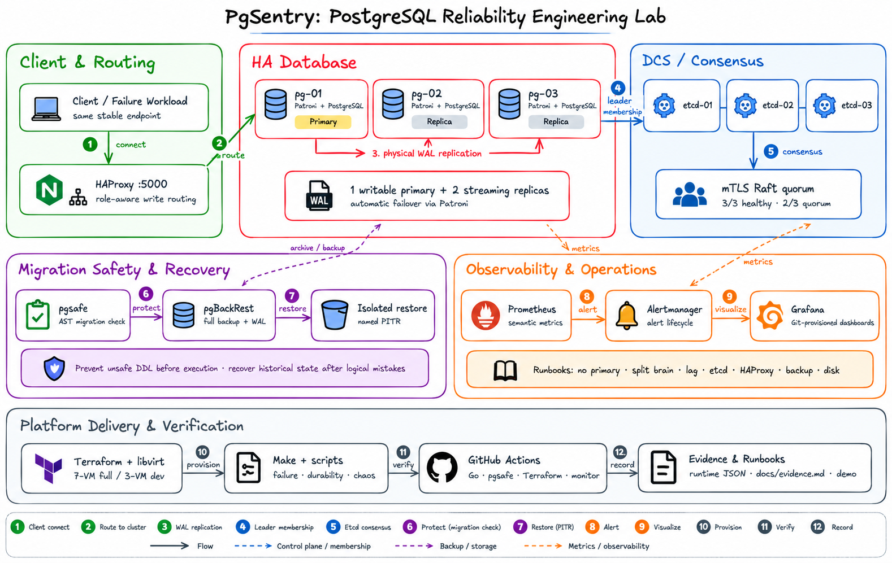

# PgSentry

**A PostgreSQL reliability engineering lab for testing what actually happens when databases fail.**

PgSentry builds a reproducible PostgreSQL HA environment and uses it to study failover, consensus, durability, network partitions, migration risk, backup recovery, and operational alerting.

The project is intentionally evidence-driven. Instead of stopping at _“PostgreSQL HA is deployed,”_ PgSentry asks:

- What does a client experience when the primary disappears?
- Can a partition produce two writable primaries?
- What changes when acknowledged commits require synchronous replication?
- What happens when PostgreSQL is healthy but HAProxy is unavailable?
- Can an unsafe migration block traffic on an otherwise healthy HA cluster?
- If a destructive `DELETE` reaches every replica, can historical data still be recovered?
- Can monitoring detect these failures and point an operator toward a safe response?

The answers come from bounded experiments on real PostgreSQL processes and real VMs rather than mocked failure paths.

<p align="center">
  
</p>

---

## Why PgSentry

High availability solves only one part of database reliability.

A replicated PostgreSQL cluster can still fail operationally because of:

- primary loss
- DCS quorum loss
- network partitions
- replication lag
- routing failure
- unsafe schema migrations
- logical mistakes replicated to every standby
- stale or unusable backups
- poor monitoring and incident response

PgSentry treats these as different failure classes and tests them independently.

```text
Infrastructure
      ↓
PostgreSQL replication
      ↓
etcd consensus
      ↓
Patroni automatic HA
      ↓
HAProxy routing
      ↓
failure measurement
      ↓
durability experiments
      ↓
network / DCS partitions
      ↓
migration safety
      ↓
backup + WAL + PITR
      ↓
metrics + alerts + runbooks
```

The goal is not to build a generic PostgreSQL deployment. The goal is to understand **database reliability behavior**.

---

## Architecture

The canonical environment contains seven Ubuntu VMs and separates database, coordination, and control-plane roles.

| Component | Responsibility |
| --- | --- |
| **PostgreSQL** | Stores data and performs physical WAL replication |
| **Patroni** | Controls PostgreSQL lifecycle and database leadership |
| **etcd** | Provides distributed coordination and leader ownership |
| **HAProxy** | Routes new client connections to the current writable primary |
| **pgBackRest** | Stores physical backups and archived WAL |
| **pgsafe** | Analyzes migration SQL before execution |
| **Prometheus** | Collects infrastructure and semantic database metrics |
| **Alertmanager** | Tracks alert lifecycle |
| **Grafana** | Presents operator-facing system state |
| **Terraform/libvirt** | Creates and destroys the reproducible VM topology |

A key ownership rule is:

```text
systemd
   ↓
Patroni
   ↓
PostgreSQL
```

The native PostgreSQL service does not independently compete with Patroni for control of the same data directory.

See [docs/architecture.md](docs/architecture.md) for the complete design.

---

## What PgSentry demonstrates

| Area | Verified behavior |
| --- | --- |
| **Infrastructure** | Seven deterministic VMs boot, obtain expected networking, accept SSH, and destroy cleanly |
| **Replication** | Exactly one primary and two read-only streaming replicas |
| **Consensus** | Three mutual-TLS etcd voters; `2/3` retains quorum while `1/3` cannot commit |
| **Database HA** | Patroni automatically promotes an eligible replica |
| **Routing** | HAProxy follows Patroni role state and exposes one stable write endpoint |
| **Failure behavior** | Client-visible interruption and ambiguous transactions are measured |
| **Durability** | Async, sync, and sync-strict PostgreSQL policies are compared |
| **Partition safety** | Controlled DCS/WAL partitions assert at most one writable primary |
| **Migration safety** | `pgsafe` statically detects operationally dangerous PostgreSQL migrations |
| **Historical recovery** | Physical backup + archived WAL reconstruct latest and historical state |
| **Operations** | Metrics, dashboards, alerts, and runbooks are exercised under real faults |

Detailed accepted evidence is consolidated in [docs/evidence.md](docs/evidence.md).

---

## Selected evidence

PgSentry deliberately distinguishes **observations** from **guarantees**.

| Experiment | Accepted evidence |
| --- | --- |
| Infrastructure | Canonical seven-VM topology created and destroyed with zero Terraform resources remaining |
| etcd quorum | `3/3` healthy, `2/3` continued consensus, `1/3` could not commit |
| Patroni HA | Automatic promotion occurred without manual `pg_ctl promote` |
| Client routing | New connections through the same HAProxy endpoint reached the promoted primary |
| Failure harness | Confirmed success, failure, and ambiguous transaction outcomes recorded independently |
| Writer safety | No accepted M5–M7 trial observed more than one writable PostgreSQL primary |
| Async durability | No acknowledged-row loss was observed in the accepted finite trials |
| Sync-strict | Writes blocked when no eligible synchronous standby remained |
| Backup | Accepted M9 physical backup: **23,436,968 bytes** in **6,499 ms** |
| Restore | Latest-state and PITR restores completed in roughly **2.5 seconds** in the canonical lab |
| PITR | A row deleted from the primary and both replicas was reconstructed from backup + WAL |
| Observability | **15/15 Prometheus targets UP**, three provisioned dashboards, four real alert fire/resolve tests |

These are controlled single-host laboratory measurements. They are **not** production SLA, RTO, or universal RPO guarantees.

---

## Failure engineering

PgSentry contains a reusable failure harness instead of a collection of one-off demos.

Normal test writes always use:

```text
client
   ↓
control-01:5000
   ↓
HAProxy
   ↓
current Patroni primary
```

The client is never reconfigured to connect directly to whichever PostgreSQL node becomes primary.

Each operation receives:

- a run ID
- a monotonically increasing sequence number
- client-side timing
- an outcome classification

Outcomes are classified as:

```text
confirmed success
confirmed failure
ambiguous outcome
```

An ambiguous transaction matters because a connection can disappear after PostgreSQL commits but before the client receives confirmation. That is different from acknowledged data loss.

### Failure scenarios

- Patroni service loss on the current primary
- abrupt primary VM loss
- replica loss
- single etcd-member loss
- primary-to-DCS isolation
- HAProxy process loss
- replica WAL partitions
- DCS quorum loss
- etcd peer partitions

Every scenario:

1. verifies a healthy baseline,
2. discovers roles dynamically,
3. injects one bounded failure,
4. measures the result,
5. restores the fault,
6. requires full cluster health before continuing.

See [M5 failure testing](docs/m5-failure-testing.md) and [M7 partition testing](docs/m7-network-dcs-chaos.md).

---

## Async vs synchronous durability

PgSentry compares three Patroni/PostgreSQL durability policies.

### Async

```text
synchronous_mode = off
```

The primary can acknowledge without requiring another PostgreSQL node to durably flush the transaction.

### Sync

```text
synchronous_mode = on
synchronous_node_count = 1
```

Patroni selects one synchronous standby.

With PostgreSQL:

```text
synchronous_commit = on
```

an acknowledged transaction waits for the selected synchronous standby to flush the required WAL.

### Sync-strict

```text
synchronous_mode = on
synchronous_mode_strict = true
synchronous_node_count = 1
```

If no synchronous standby is available, the system does not silently fall back to ordinary asynchronous acknowledgements.

In the accepted M6 experiment, bounded writes remained blocked until a standby returned.

That demonstrates the core tradeoff:

```text
higher write availability
        ↕
stronger acknowledgement durability
```

There is no universally correct policy.

See [docs/m6-synchronous-durability.md](docs/m6-synchronous-durability.md).

---

## Migration safety with `pgsafe`

High availability does not protect a database from dangerous DDL.

A healthy Patroni cluster can still suffer application impact from:

```sql
CREATE INDEX ...
ALTER TABLE ...
DROP TABLE ...
TRUNCATE ...
DELETE FROM table;
UPDATE table SET ...;
```

PgSentry therefore includes **`pgsafe`**, a standalone read-only Go CLI for PostgreSQL 16 migration analysis.

```text
SQL migration
      ↓
PostgreSQL parser
      ↓
AST
      ↓
pgsafe rules
      ↓
explainable diagnostics
      ↓
PR / CI
```

`pgsafe` never connects to PostgreSQL and never executes the migration.

It detects classes of problems such as:

- ordinary `CREATE INDEX` on live tables
- invalid `CREATE INDEX CONCURRENTLY` transaction usage
- strong-lock `ALTER TABLE`
- risky type changes
- immediate constraint validation
- risky `SET NOT NULL`
- destructive `DROP`
- `TRUNCATE`
- `DELETE` without `WHERE`
- `UPDATE` without `WHERE`
- missing lock-timeout policy

It also accounts for PostgreSQL 16 behavior rather than blindly applying outdated migration advice.

### Example

```bash
make pgsafe-build

./bin/pgsafe check migration.sql

./bin/pgsafe check migration.sql \
  --format=json \
  --fail-on=high

./bin/pgsafe explain PGSAFE001
```

Static analysis is paired with real PostgreSQL lock experiments using disposable tables.

See:

- [pgsafe guide](docs/m8-pgsafe.md)
- [rule catalog](docs/pgsafe-rules.md)

---

## Why replication is not backup

Consider this:

```text
primary
   |
   | DELETE important row
   v
replica 1  -> row deleted
replica 2  -> row deleted
```

Streaming replication behaved correctly. It copied the mistake.

M9 demonstrated the alternative recovery path:

```text
physical backup
       +
 archived WAL
       +
 recovery target
       ↓
 isolated PostgreSQL
       ↓
 historical row restored
```

The accepted PITR experiment:

1. created a protected row,
2. created a named PostgreSQL restore point,
3. deleted the row through HAProxy,
4. verified the deletion on the primary,
5. verified the deletion on both replicas,
6. restored a physical backup,
7. replayed archived WAL only to the chosen restore point,
8. verified the deleted row existed again.

Latest-state recovery also reconstructed data written **after** the full backup, proving that archived WAL—not only the base backup—was required.

See [docs/m9-backup-pitr.md](docs/m9-backup-pitr.md).

---

## Observability

PgSentry monitors semantic database state rather than only asking whether processes are running.

The final canonical monitoring environment had:

```text
Prometheus targets: 15 / 15 UP
PostgreSQL primary count: 1
PostgreSQL replica count: 2
largest replication lag: 0 bytes
etcd healthy members: 3
HAProxy writable backends: 1
WAL archive failures: 0
firing alerts: 0
```

Metrics come from:

- node_exporter on all seven VMs
- Patroni native metrics
- etcd native metrics over mTLS
- HAProxy native Prometheus metrics
- PgSentry semantic collectors
- PostgreSQL `pg_monitor` queries
- pgBackRest / WAL archive state

### Grafana dashboards

Three dashboards are provisioned entirely from Git:

- **PgSentry Overview**
- **PgSentry PostgreSQL**
- **PgSentry DCS, Routing, Recovery**

No manual dashboard construction is required after deployment.

---

## Alerting and runbooks

Alerts focus on operationally meaningful failure states.

| Alert | Meaning |
| --- | --- |
| `PgSentryMultiplePrimaries` | More than one writable PostgreSQL primary |
| `PgSentryNoPrimary` | No writable PostgreSQL primary |
| `PgSentryReplicaCountLow` | Replica redundancy degraded |
| `PgSentryReplicationLagHigh` | Replica WAL lag exceeds the lab threshold |
| `PgSentryEtcdMemberDown` | etcd redundancy degraded |
| `PgSentryEtcdQuorumLost` | etcd majority unavailable |
| `PgSentryHAProxyDown` | Stable client routing layer unavailable |
| `PgSentryNoWritableBackend` | HAProxy cannot find a valid primary |
| `PgSentryWALArchiveFailure` | New WAL archival failure detected |
| `PgSentryBackupStale` | Last successful backup older than policy threshold |
| `PgSentryDiskSpaceLow` | Filesystem capacity approaching exhaustion |

M10 did not merely validate alert YAML. It injected real faults and verified alert lifecycle for:

- replica loss
- etcd-member loss
- HAProxy loss
- replication lag

Each alert was observed in Prometheus and Alertmanager and then verified to resolve after recovery.

Runbooks live under:

```text
docs/runbooks/
```

The multiple-primary runbook explicitly prioritizes **fencing unsafe writers before restoring availability**.

See [docs/m10-observability.md](docs/m10-observability.md).

---

## Canonical and development profiles

PgSentry provides two environments.

| Profile | Nodes | Purpose |
| --- | ---: | --- |
| `full` | 7 | Canonical reliability evidence |
| `colocated` | 3 | Lower-cost development |

The canonical topology separates PostgreSQL, etcd, and control roles so a database failure does not implicitly remove a DCS voter.

All published M5–M10 runtime evidence uses:

```text
PROFILE=full
```

---

## Quick start

### Requirements

- Linux
- KVM
- system libvirt
- Terraform 1.8+
- active libvirt `default` storage pool
- OpenSSH key
- enough CPU/RAM/storage for seven Ubuntu VMs

Create the canonical variables file:

```bash
cp \
  terraform/environments/full/terraform.tfvars.example \
  terraform/environments/full/terraform.tfvars
```

Validate infrastructure:

```bash
make tf-validate
```

Provision:

```bash
make cluster-up PROFILE=full
```

Configure the core stack:

```bash
make etcd-configure PROFILE=full
make patroni-configure PROFILE=full
make haproxy-configure PROFILE=full
```

Verify:

```bash
make etcd-verify PROFILE=full
make patroni-verify PROFILE=full
make haproxy-verify PROFILE=full
```

Configure recovery and monitoring:

```bash
make backup-configure PROFILE=full
make backup-check PROFILE=full

make observability-configure PROFILE=full
make observability-verify PROFILE=full
```

Use [docs/operations.md](docs/operations.md) for day-to-day inspection.

---

## Try a reliability experiment

Run a normal baseline:

```bash
make failure-baseline PROFILE=full
```

Run one bounded failure:

```bash
make failure-scenario \
  PROFILE=full \
  SCENARIO=primary-service-loss
```

Run the complete M5 matrix:

```bash
make failure-matrix PROFILE=full
make failure-report
```

Network/DCS experiments are separately exposed:

```bash
make chaos-baseline PROFILE=full

make chaos-scenario \
  PROFILE=full \
  CHAOS_SCENARIO=replica-dcs-isolation
```

These targets deliberately manipulate the lab. Read the relevant runbook before executing destructive scenarios.

---

## Demo

For a shorter portfolio walkthrough, see [docs/demo.md](docs/demo.md).

The demo focuses on:

1. healthy PostgreSQL/Patroni state,
2. Grafana overview,
3. a write through HAProxy,
4. replica failure + alert firing,
5. alert recovery,
6. `pgsafe` detecting unsafe SQL,
7. backup/PITR evidence,
8. final health.

The full failure matrices are intentionally not required for a short demo.

---

## Repository layout

```text
.
├── cmd/
│   └── pgsafe/
├── internal/
│   └── pgsafe/
├── monitoring/
│   ├── prometheus/
│   ├── alertmanager/
│   └── grafana/
├── scripts/
│   ├── postgres/
│   ├── etcd/
│   ├── ha/
│   ├── failures/
│   ├── durability/
│   ├── chaos/
│   ├── migrations/
│   ├── backup/
│   └── observability/
├── terraform/
│   ├── environments/
│   │   ├── colocated/
│   │   └── full/
│   └── modules/
├── docs/
│   ├── images/
│   ├── runbooks/
│   ├── architecture.md
│   ├── evidence.md
│   ├── operations.md
│   ├── demo.md
│   └── m*.md
└── Makefile
```

---

## CI model

PgSentry separates portable static verification from VM-backed reliability testing.

### GitHub-hosted CI

Runs checks that do not require KVM/libvirt:

```text
Go tests
gofmt
go vet
pgsafe fixtures
Terraform formatting/validation
shell syntax
Python validation
Prometheus configuration/rules
Alertmanager configuration
Grafana JSON
runbook links
secret scanning
```

### Canonical runtime verification

Requires the real seven-VM environment for:

```text
PostgreSQL failover
network partitions
DCS quorum experiments
migration lock demonstrations
backup restore
PITR
alert lifecycle tests
```

The repository does not present mocked hosted-CI checks as equivalent to those runtime experiments.

---

## Security model

PgSentry keeps runtime credentials out of Git.

Examples include:

- PostgreSQL replication passwords
- PostgreSQL monitoring credentials
- etcd TLS private keys
- Patroni etcd credentials
- Grafana administrator password
- backup runtime credentials

Runtime state is generated beneath ignored:

```text
.pgsentry/
```

Additional boundaries include:

- etcd client and peer mutual TLS
- dedicated PostgreSQL `pg_monitor` account
- authenticated Grafana
- private libvirt networking
- loopback-only Prometheus/Alertmanager where appropriate
- loopback HAProxy metrics
- no backup data, WAL, VM disks, Terraform state, or monitoring databases committed to Git

Secret scanning is part of PR verification.

---

## Cleanup

When finished:

```bash
make observability-clean PROFILE=full
make backup-clean PROFILE=full
make cluster-down PROFILE=full
```

The accepted milestone runs verify teardown rather than assuming it.

Final canonical audits checked for:

```text
Terraform resources = 0
project libvirt domains = 0
project networks = 0
project volumes = 0
runtime .pgsentry state = absent
backup repository = removed
WAL archive = removed
temporary restore state = removed
monitoring runtime state = removed
```

---

## Documentation

| Document | Purpose |
| --- | --- |
| [Architecture](docs/architecture.md) | Final system design and boundaries |
| [Evidence](docs/evidence.md) | Consolidated accepted runtime evidence |
| [Operations](docs/operations.md) | Operator entry point |
| [Demo](docs/demo.md) | Short reproducible walkthrough |
| [Runbooks](docs/runbooks/) | Incident-response procedures |
| [M5 failure testing](docs/m5-failure-testing.md) | Client-visible failure harness |
| [M6 durability](docs/m6-synchronous-durability.md) | Async/sync experiments |
| [M7 partitions](docs/m7-network-dcs-chaos.md) | Network and DCS chaos |
| [M8 pgsafe](docs/m8-pgsafe.md) | Migration-safety analyzer |
| [pgsafe rules](docs/pgsafe-rules.md) | Rule catalog |
| [M9 backup/PITR](docs/m9-backup-pitr.md) | Historical recovery |
| [M10 observability](docs/m10-observability.md) | Metrics, alerts, dashboards |

---

## Limitations

PgSentry is a **single-host reliability lab**, not production-ready database infrastructure.

It does not establish:

- a production SLA
- guaranteed RTO or RPO
- correctness under every failure ordering
- multi-region consensus
- geographic disaster recovery
- off-site or immutable backup storage
- HA Prometheus/Grafana/Alertmanager
- redundant HAProxy routing
- perfect alert thresholds
- unlimited workload scalability
- complete PostgreSQL migration semantic coverage
- application-level idempotency
- automatic remediation
- ransomware-resistant backups
- Kubernetes or cloud production readiness

These boundaries are intentional. The project is designed to make claims only where reproducible evidence exists.

---

## Project status

**M1–M10 complete.**

```text
M1   Infrastructure
M2   PostgreSQL replication
M3   etcd quorum
M4   Patroni HA + HAProxy
M5   Failure measurement
M6   Synchronous durability
M7   Network / DCS chaos
M8   pgsafe migration safety
M9   Backup + WAL + PITR
M10  Observability + runbooks
```

The planned PgSentry roadmap is complete.

Possible future work—off-site object storage, redundant routing, HA monitoring, geographic disaster recovery, self-hosted reliability CI, and longer soak tests—is intentionally outside the finished project.

---

## Core lesson

> **Database reliability is not a feature you enable. It is behavior you have to test.**

Replication, consensus, failover, durability, migration safety, backup, recovery, and observability solve different failure classes.

PgSentry puts those failure classes into one reproducible lab and records what actually happens.# PgSentry

**A PostgreSQL reliability engineering lab for testing what actually happens when databases fail.**

PgSentry builds a reproducible PostgreSQL HA environment and uses it to study failover, consensus, durability, network partitions, migration risk, backup recovery, and operational alerting.

The project is intentionally evidence-driven. Instead of stopping at _“PostgreSQL HA is deployed,”_ PgSentry asks:

- What does a client experience when the primary disappears?
- Can a partition produce two writable primaries?
- What changes when acknowledged commits require synchronous replication?
- What happens when PostgreSQL is healthy but HAProxy is unavailable?
- Can an unsafe migration block traffic on an otherwise healthy HA cluster?
- If a destructive `DELETE` reaches every replica, can historical data still be recovered?
- Can monitoring detect these failures and point an operator toward a safe response?

The answers come from bounded experiments on real PostgreSQL processes and real VMs rather than mocked failure paths.

<p align="center">
  
</p>

---

## Why PgSentry

High availability solves only one part of database reliability.

A replicated PostgreSQL cluster can still fail operationally because of:

- primary loss
- DCS quorum loss
- network partitions
- replication lag
- routing failure
- unsafe schema migrations
- logical mistakes replicated to every standby
- stale or unusable backups
- poor monitoring and incident response

PgSentry treats these as different failure classes and tests them independently.

```text
Infrastructure
      ↓
PostgreSQL replication
      ↓
etcd consensus
      ↓
Patroni automatic HA
      ↓
HAProxy routing
      ↓
failure measurement
      ↓
durability experiments
      ↓
network / DCS partitions
      ↓
migration safety
      ↓
backup + WAL + PITR
      ↓
metrics + alerts + runbooks
```

The goal is not to build a generic PostgreSQL deployment. The goal is to understand **database reliability behavior**.

---

## Architecture

The canonical environment contains seven Ubuntu VMs and separates database, coordination, and control-plane roles.

| Component | Responsibility |
| --- | --- |
| **PostgreSQL** | Stores data and performs physical WAL replication |
| **Patroni** | Controls PostgreSQL lifecycle and database leadership |
| **etcd** | Provides distributed coordination and leader ownership |
| **HAProxy** | Routes new client connections to the current writable primary |
| **pgBackRest** | Stores physical backups and archived WAL |
| **pgsafe** | Analyzes migration SQL before execution |
| **Prometheus** | Collects infrastructure and semantic database metrics |
| **Alertmanager** | Tracks alert lifecycle |
| **Grafana** | Presents operator-facing system state |
| **Terraform/libvirt** | Creates and destroys the reproducible VM topology |

A key ownership rule is:

```text
systemd
   ↓
Patroni
   ↓
PostgreSQL
```

The native PostgreSQL service does not independently compete with Patroni for control of the same data directory.

See [docs/architecture.md](docs/architecture.md) for the complete design.

---

## What PgSentry demonstrates

| Area | Verified behavior |
| --- | --- |
| **Infrastructure** | Seven deterministic VMs boot, obtain expected networking, accept SSH, and destroy cleanly |
| **Replication** | Exactly one primary and two read-only streaming replicas |
| **Consensus** | Three mutual-TLS etcd voters; `2/3` retains quorum while `1/3` cannot commit |
| **Database HA** | Patroni automatically promotes an eligible replica |
| **Routing** | HAProxy follows Patroni role state and exposes one stable write endpoint |
| **Failure behavior** | Client-visible interruption and ambiguous transactions are measured |
| **Durability** | Async, sync, and sync-strict PostgreSQL policies are compared |
| **Partition safety** | Controlled DCS/WAL partitions assert at most one writable primary |
| **Migration safety** | `pgsafe` statically detects operationally dangerous PostgreSQL migrations |
| **Historical recovery** | Physical backup + archived WAL reconstruct latest and historical state |
| **Operations** | Metrics, dashboards, alerts, and runbooks are exercised under real faults |

Detailed accepted evidence is consolidated in [docs/evidence.md](docs/evidence.md).

---

## Selected evidence

PgSentry deliberately distinguishes **observations** from **guarantees**.

| Experiment | Accepted evidence |
| --- | --- |
| Infrastructure | Canonical seven-VM topology created and destroyed with zero Terraform resources remaining |
| etcd quorum | `3/3` healthy, `2/3` continued consensus, `1/3` could not commit |
| Patroni HA | Automatic promotion occurred without manual `pg_ctl promote` |
| Client routing | New connections through the same HAProxy endpoint reached the promoted primary |
| Failure harness | Confirmed success, failure, and ambiguous transaction outcomes recorded independently |
| Writer safety | No accepted M5–M7 trial observed more than one writable PostgreSQL primary |
| Async durability | No acknowledged-row loss was observed in the accepted finite trials |
| Sync-strict | Writes blocked when no eligible synchronous standby remained |
| Backup | Accepted M9 physical backup: **23,436,968 bytes** in **6,499 ms** |
| Restore | Latest-state and PITR restores completed in roughly **2.5 seconds** in the canonical lab |
| PITR | A row deleted from the primary and both replicas was reconstructed from backup + WAL |
| Observability | **15/15 Prometheus targets UP**, three provisioned dashboards, four real alert fire/resolve tests |

These are controlled single-host laboratory measurements. They are **not** production SLA, RTO, or universal RPO guarantees.

---

## Failure engineering

PgSentry contains a reusable failure harness instead of a collection of one-off demos.

Normal test writes always use:

```text
client
   ↓
control-01:5000
   ↓
HAProxy
   ↓
current Patroni primary
```

The client is never reconfigured to connect directly to whichever PostgreSQL node becomes primary.

Each operation receives:

- a run ID
- a monotonically increasing sequence number
- client-side timing
- an outcome classification

Outcomes are classified as:

```text
confirmed success
confirmed failure
ambiguous outcome
```

An ambiguous transaction matters because a connection can disappear after PostgreSQL commits but before the client receives confirmation. That is different from acknowledged data loss.

### Failure scenarios

- Patroni service loss on the current primary
- abrupt primary VM loss
- replica loss
- single etcd-member loss
- primary-to-DCS isolation
- HAProxy process loss
- replica WAL partitions
- DCS quorum loss
- etcd peer partitions

Every scenario:

1. verifies a healthy baseline,
2. discovers roles dynamically,
3. injects one bounded failure,
4. measures the result,
5. restores the fault,
6. requires full cluster health before continuing.

See [M5 failure testing](docs/m5-failure-testing.md) and [M7 partition testing](docs/m7-network-dcs-chaos.md).

---

## Async vs synchronous durability

PgSentry compares three Patroni/PostgreSQL durability policies.

### Async

```text
synchronous_mode = off
```

The primary can acknowledge without requiring another PostgreSQL node to durably flush the transaction.

### Sync

```text
synchronous_mode = on
synchronous_node_count = 1
```

Patroni selects one synchronous standby.

With PostgreSQL:

```text
synchronous_commit = on
```

an acknowledged transaction waits for the selected synchronous standby to flush the required WAL.

### Sync-strict

```text
synchronous_mode = on
synchronous_mode_strict = true
synchronous_node_count = 1
```

If no synchronous standby is available, the system does not silently fall back to ordinary asynchronous acknowledgements.

In the accepted M6 experiment, bounded writes remained blocked until a standby returned.

That demonstrates the core tradeoff:

```text
higher write availability
        ↕
stronger acknowledgement durability
```

There is no universally correct policy.

See [docs/m6-synchronous-durability.md](docs/m6-synchronous-durability.md).

---

## Migration safety with `pgsafe`

High availability does not protect a database from dangerous DDL.

A healthy Patroni cluster can still suffer application impact from:

```sql
CREATE INDEX ...
ALTER TABLE ...
DROP TABLE ...
TRUNCATE ...
DELETE FROM table;
UPDATE table SET ...;
```

PgSentry therefore includes **`pgsafe`**, a standalone read-only Go CLI for PostgreSQL 16 migration analysis.

```text
SQL migration
      ↓
PostgreSQL parser
      ↓
AST
      ↓
pgsafe rules
      ↓
explainable diagnostics
      ↓
PR / CI
```

`pgsafe` never connects to PostgreSQL and never executes the migration.

It detects classes of problems such as:

- ordinary `CREATE INDEX` on live tables
- invalid `CREATE INDEX CONCURRENTLY` transaction usage
- strong-lock `ALTER TABLE`
- risky type changes
- immediate constraint validation
- risky `SET NOT NULL`
- destructive `DROP`
- `TRUNCATE`
- `DELETE` without `WHERE`
- `UPDATE` without `WHERE`
- missing lock-timeout policy

It also accounts for PostgreSQL 16 behavior rather than blindly applying outdated migration advice.

### Example

```bash
make pgsafe-build

./bin/pgsafe check migration.sql

./bin/pgsafe check migration.sql \
  --format=json \
  --fail-on=high

./bin/pgsafe explain PGSAFE001
```

Static analysis is paired with real PostgreSQL lock experiments using disposable tables.

See:

- [pgsafe guide](docs/m8-pgsafe.md)
- [rule catalog](docs/pgsafe-rules.md)

---

## Why replication is not backup

Consider this:

```text
primary
   |
   | DELETE important row
   v
replica 1  -> row deleted
replica 2  -> row deleted
```

Streaming replication behaved correctly. It copied the mistake.

M9 demonstrated the alternative recovery path:

```text
physical backup
       +
 archived WAL
       +
 recovery target
       ↓
 isolated PostgreSQL
       ↓
 historical row restored
```

The accepted PITR experiment:

1. created a protected row,
2. created a named PostgreSQL restore point,
3. deleted the row through HAProxy,
4. verified the deletion on the primary,
5. verified the deletion on both replicas,
6. restored a physical backup,
7. replayed archived WAL only to the chosen restore point,
8. verified the deleted row existed again.

Latest-state recovery also reconstructed data written **after** the full backup, proving that archived WAL—not only the base backup—was required.

See [docs/m9-backup-pitr.md](docs/m9-backup-pitr.md).

---

## Observability

PgSentry monitors semantic database state rather than only asking whether processes are running.

The final canonical monitoring environment had:

```text
Prometheus targets: 15 / 15 UP
PostgreSQL primary count: 1
PostgreSQL replica count: 2
largest replication lag: 0 bytes
etcd healthy members: 3
HAProxy writable backends: 1
WAL archive failures: 0
firing alerts: 0
```

Metrics come from:

- node_exporter on all seven VMs
- Patroni native metrics
- etcd native metrics over mTLS
- HAProxy native Prometheus metrics
- PgSentry semantic collectors
- PostgreSQL `pg_monitor` queries
- pgBackRest / WAL archive state

### Grafana dashboards

Three dashboards are provisioned entirely from Git:

- **PgSentry Overview**
- **PgSentry PostgreSQL**
- **PgSentry DCS, Routing, Recovery**

No manual dashboard construction is required after deployment.

---

## Alerting and runbooks

Alerts focus on operationally meaningful failure states.

| Alert | Meaning |
| --- | --- |
| `PgSentryMultiplePrimaries` | More than one writable PostgreSQL primary |
| `PgSentryNoPrimary` | No writable PostgreSQL primary |
| `PgSentryReplicaCountLow` | Replica redundancy degraded |
| `PgSentryReplicationLagHigh` | Replica WAL lag exceeds the lab threshold |
| `PgSentryEtcdMemberDown` | etcd redundancy degraded |
| `PgSentryEtcdQuorumLost` | etcd majority unavailable |
| `PgSentryHAProxyDown` | Stable client routing layer unavailable |
| `PgSentryNoWritableBackend` | HAProxy cannot find a valid primary |
| `PgSentryWALArchiveFailure` | New WAL archival failure detected |
| `PgSentryBackupStale` | Last successful backup older than policy threshold |
| `PgSentryDiskSpaceLow` | Filesystem capacity approaching exhaustion |

M10 did not merely validate alert YAML. It injected real faults and verified alert lifecycle for:

- replica loss
- etcd-member loss
- HAProxy loss
- replication lag

Each alert was observed in Prometheus and Alertmanager and then verified to resolve after recovery.

Runbooks live under:

```text
docs/runbooks/
```

The multiple-primary runbook explicitly prioritizes **fencing unsafe writers before restoring availability**.

See [docs/m10-observability.md](docs/m10-observability.md).

---

## Canonical and development profiles

PgSentry provides two environments.

| Profile | Nodes | Purpose |
| --- | ---: | --- |
| `full` | 7 | Canonical reliability evidence |
| `colocated` | 3 | Lower-cost development |

The canonical topology separates PostgreSQL, etcd, and control roles so a database failure does not implicitly remove a DCS voter.

All published M5–M10 runtime evidence uses:

```text
PROFILE=full
```

---

## Quick start

### Requirements

- Linux
- KVM
- system libvirt
- Terraform 1.8+
- active libvirt `default` storage pool
- OpenSSH key
- enough CPU/RAM/storage for seven Ubuntu VMs

Create the canonical variables file:

```bash
cp \
  terraform/environments/full/terraform.tfvars.example \
  terraform/environments/full/terraform.tfvars
```

Validate infrastructure:

```bash
make tf-validate
```

Provision:

```bash
make cluster-up PROFILE=full
```

Configure the core stack:

```bash
make etcd-configure PROFILE=full
make patroni-configure PROFILE=full
make haproxy-configure PROFILE=full
```

Verify:

```bash
make etcd-verify PROFILE=full
make patroni-verify PROFILE=full
make haproxy-verify PROFILE=full
```

Configure recovery and monitoring:

```bash
make backup-configure PROFILE=full
make backup-check PROFILE=full

make observability-configure PROFILE=full
make observability-verify PROFILE=full
```

Use [docs/operations.md](docs/operations.md) for day-to-day inspection.

---

## Try a reliability experiment

Run a normal baseline:

```bash
make failure-baseline PROFILE=full
```

Run one bounded failure:

```bash
make failure-scenario \
  PROFILE=full \
  SCENARIO=primary-service-loss
```

Run the complete M5 matrix:

```bash
make failure-matrix PROFILE=full
make failure-report
```

Network/DCS experiments are separately exposed:

```bash
make chaos-baseline PROFILE=full

make chaos-scenario \
  PROFILE=full \
  CHAOS_SCENARIO=replica-dcs-isolation
```

These targets deliberately manipulate the lab. Read the relevant runbook before executing destructive scenarios.

---

## Demo

For a shorter portfolio walkthrough, see [docs/demo.md](docs/demo.md).

The demo focuses on:

1. healthy PostgreSQL/Patroni state,
2. Grafana overview,
3. a write through HAProxy,
4. replica failure + alert firing,
5. alert recovery,
6. `pgsafe` detecting unsafe SQL,
7. backup/PITR evidence,
8. final health.

The full failure matrices are intentionally not required for a short demo.

---

## Repository layout

```text
.
├── cmd/
│   └── pgsafe/
├── internal/
│   └── pgsafe/
├── monitoring/
│   ├── prometheus/
│   ├── alertmanager/
│   └── grafana/
├── scripts/
│   ├── postgres/
│   ├── etcd/
│   ├── ha/
│   ├── failures/
│   ├── durability/
│   ├── chaos/
│   ├── migrations/
│   ├── backup/
│   └── observability/
├── terraform/
│   ├── environments/
│   │   ├── colocated/
│   │   └── full/
│   └── modules/
├── docs/
│   ├── images/
│   ├── runbooks/
│   ├── architecture.md
│   ├── evidence.md
│   ├── operations.md
│   ├── demo.md
│   └── m*.md
└── Makefile
```

---

## CI model

PgSentry separates portable static verification from VM-backed reliability testing.

### GitHub-hosted CI

Runs checks that do not require KVM/libvirt:

```text
Go tests
gofmt
go vet
pgsafe fixtures
Terraform formatting/validation
shell syntax
Python validation
Prometheus configuration/rules
Alertmanager configuration
Grafana JSON
runbook links
secret scanning
```

### Canonical runtime verification

Requires the real seven-VM environment for:

```text
PostgreSQL failover
network partitions
DCS quorum experiments
migration lock demonstrations
backup restore
PITR
alert lifecycle tests
```

The repository does not present mocked hosted-CI checks as equivalent to those runtime experiments.

---

## Security model

PgSentry keeps runtime credentials out of Git.

Examples include:

- PostgreSQL replication passwords
- PostgreSQL monitoring credentials
- etcd TLS private keys
- Patroni etcd credentials
- Grafana administrator password
- backup runtime credentials

Runtime state is generated beneath ignored:

```text
.pgsentry/
```

Additional boundaries include:

- etcd client and peer mutual TLS
- dedicated PostgreSQL `pg_monitor` account
- authenticated Grafana
- private libvirt networking
- loopback-only Prometheus/Alertmanager where appropriate
- loopback HAProxy metrics
- no backup data, WAL, VM disks, Terraform state, or monitoring databases committed to Git

Secret scanning is part of PR verification.

---

## Cleanup

When finished:

```bash
make observability-clean PROFILE=full
make backup-clean PROFILE=full
make cluster-down PROFILE=full
```

The accepted milestone runs verify teardown rather than assuming it.

Final canonical audits checked for:

```text
Terraform resources = 0
project libvirt domains = 0
project networks = 0
project volumes = 0
runtime .pgsentry state = absent
backup repository = removed
WAL archive = removed
temporary restore state = removed
monitoring runtime state = removed
```

---

## Documentation

| Document | Purpose |
| --- | --- |
| [Architecture](docs/architecture.md) | Final system design and boundaries |
| [Evidence](docs/evidence.md) | Consolidated accepted runtime evidence |
| [Operations](docs/operations.md) | Operator entry point |
| [Demo](docs/demo.md) | Short reproducible walkthrough |
| [Runbooks](docs/runbooks/) | Incident-response procedures |
| [M5 failure testing](docs/m5-failure-testing.md) | Client-visible failure harness |
| [M6 durability](docs/m6-synchronous-durability.md) | Async/sync experiments |
| [M7 partitions](docs/m7-network-dcs-chaos.md) | Network and DCS chaos |
| [M8 pgsafe](docs/m8-pgsafe.md) | Migration-safety analyzer |
| [pgsafe rules](docs/pgsafe-rules.md) | Rule catalog |
| [M9 backup/PITR](docs/m9-backup-pitr.md) | Historical recovery |
| [M10 observability](docs/m10-observability.md) | Metrics, alerts, dashboards |

---

## Limitations

PgSentry is a **single-host reliability lab**, not production-ready database infrastructure.

It does not establish:

- a production SLA
- guaranteed RTO or RPO
- correctness under every failure ordering
- multi-region consensus
- geographic disaster recovery
- off-site or immutable backup storage
- HA Prometheus/Grafana/Alertmanager
- redundant HAProxy routing
- perfect alert thresholds
- unlimited workload scalability
- complete PostgreSQL migration semantic coverage
- application-level idempotency
- automatic remediation
- ransomware-resistant backups
- Kubernetes or cloud production readiness

These boundaries are intentional. The project is designed to make claims only where reproducible evidence exists.

---

## Project status

**M1–M10 complete.**

```text
M1   Infrastructure
M2   PostgreSQL replication
M3   etcd quorum
M4   Patroni HA + HAProxy
M5   Failure measurement
M6   Synchronous durability
M7   Network / DCS chaos
M8   pgsafe migration safety
M9   Backup + WAL + PITR
M10  Observability + runbooks
```

The planned PgSentry roadmap is complete.

Possible future work—off-site object storage, redundant routing, HA monitoring, geographic disaster recovery, self-hosted reliability CI, and longer soak tests—is intentionally outside the finished project.

---

## Core lesson

> **Database reliability is not a feature you enable. It is behavior you have to test.**

Replication, consensus, failover, durability, migration safety, backup, recovery, and observability solve different failure classes.

PgSentry puts those failure classes into one reproducible lab and records what actually happens.